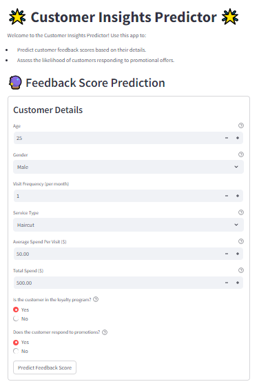

# 🌟 Customer Insights Predictor

Welcome to the **Customer Insights Predictor**, a user-friendly Streamlit application that offers predictive insights into customer behavior. This app provides two key functionalities to enhance your business decision-making:

1. **Feedback Score Prediction**: Predict customer feedback scores based on their demographic and transactional details.
2. **Promotional Response Prediction**: Assess the likelihood of customers responding to promotional offers.

---

## 🚀 Features

- **Feedback Score Prediction**:
  - Input customer details like age, gender, visit frequency, service type, and spending habits.
  - Predict the feedback score on a scale of 1 to 5.
  
- **Promotional Response Prediction**:
  - Input customer details along with their feedback score.
  - Predict the likelihood of a customer responding to promotional campaigns.

- **Dynamic Feature Engineering**:
  - Automatically categorizes customer data into groups like Age Group, Customer Value, and Visit Frequency Group for enhanced prediction accuracy.

---

## 🛠️ How It Works

1. **Data Input**:
   - Users fill out forms with customer data, including age, gender, visit frequency, service type, average spend, and total spend.
   - Additional fields like loyalty program status and feedback scores are also considered.

2. **Prediction Models**:
   - The app uses two pre-trained Logistic Regression models:
     - `LogisticRegression_Feedback_Score_model.pkl`: For predicting feedback scores.
     - `LogisticRegression_Promotional_Response_model.pkl`: For predicting promotional response likelihood.

3. **Output**:
   - Clear, actionable predictions displayed with supporting metrics and explanations.

---

## 🧰 Technologies Used

- **Streamlit**: For building the interactive web app.
- **Python Libraries**:
  - `pandas` and `numpy`: For data manipulation and preprocessing.
  - `joblib`: For loading pre-trained models.
- **Machine Learning**:
  - Pre-trained Logistic Regression models.

---

## 📂 File Structure

```plaintext
📦 Customer_Insights_Predictor
 ┣ 📜 README.md
 ┣ 📜 README_MachineLearning.md
 ┣ 📜 README_StreamlitAPP.md
 ┣ 📜 mainappV1.py   
 ┣ 📜 LogisticRegression_Feedback_Score_model.pkl
 ┣ 📜 LogisticRegression_Promotional_Response_model.pkl               
 ┣ 📜 requirements.txt
 ┗ 📂 assets
    ┗ 📜 screenshots/       # Screenshots of the application
```

---

## 🖥️ How to Run the App

1. **Clone the Repository**:
   ```bash
   git clone https://github.com/aminmoghadasi75/Hair_Saloon.git

   ```

2. **Install Dependencies**:
   Make sure you have Python installed, then run:
   ```bash
   pip install -r requirements.txt
   ```

3. **Launch the Application**:
   ```bash
   streamlit run mainappV1.py
   ```

4. **Access the App**:
   Open the app in your browser at `http://localhost:8501`.

---

## 🎯 Use Cases

- Enhance customer retention strategies by understanding feedback trends.
- Maximize marketing ROI by targeting customers likely to respond to promotions.
- Provide actionable insights for decision-making in customer-facing businesses like retail, salons, or service industries.

---

## 📸 Screenshots 


---

## 🤝 Contributions

Contributions, issues, and feature requests are welcome! Feel free to check the [issues page](https://github.com/aminmoghadasi75/Hair_Saloon/issues).

---

## 🌟 Acknowledgements

- Special thanks to the developers and contributors of the libraries and tools used.
- Inspiration for this app came from real-world customer behavior analysis use cases.

---

## 📧 Contact

For further information or inquiries, feel free to reach out via:
- **Email**: m.aminmoghadasi75 @gmail.com
- **GitHub**: [aminmoghadasi75](https://github.com/aminmoghadasi75)

---
✨ *Empowering businesses with data-driven insights!* ✨
```

